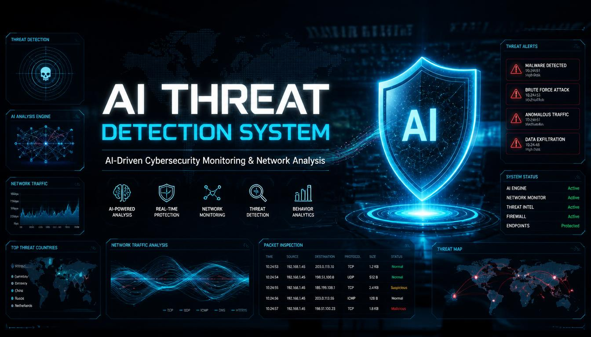
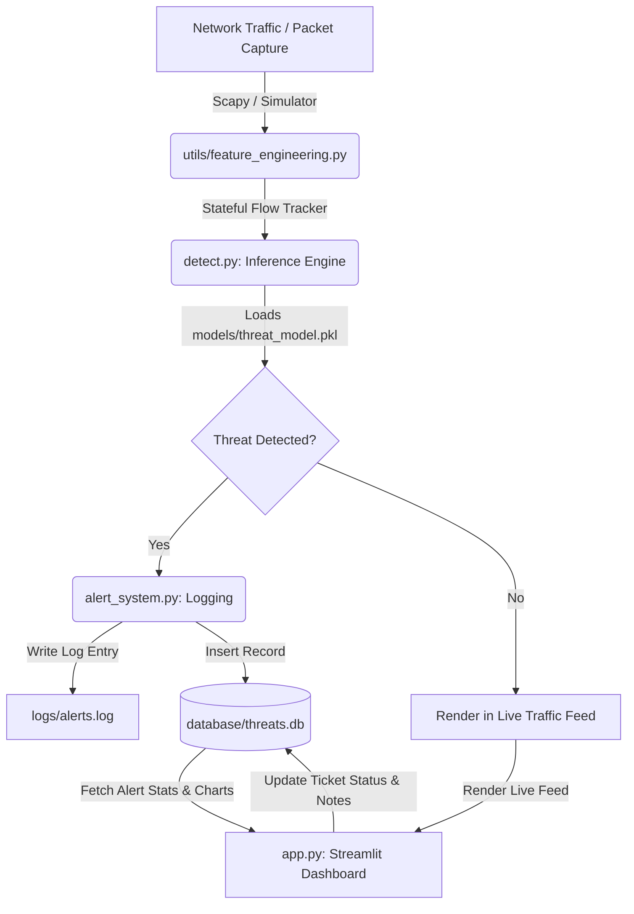

# 🛡️ AI-Driven Threat Detection System

<p align="center">
  
</p>

An enterprise-grade, machine learning-powered Security Operations Center (SOC) platform designed to capture network traffic, detect malicious activity, classify intrusion vectors using a Random Forest Classifier, and manage alerts in an interactive dashboard.

---

## 📋 Table of Contents
- [Project Overview](#-project-overview)
- [Deloitte Internship Relevance](#-deloitte-internship-relevance)
- [Key Features](#-key-features)
- [System Architecture](#-system-architecture)
- [Folder Structure](#-folder-structure)
- [Technologies Used](#-technologies-used)
- [Machine Learning Workflow](#-machine-learning-workflow)
- [Installation & Setup](#-installation--setup)
- [Usage Guide](#-usage-guide)
- [Dashboard Preview](#-dashboard-preview)
- [Future Enhancements](#-future-enhancements)
- [License](#-license)
- [Author](#-author)

---

## 🌟 Project Overview
This project simulates an Intrusion Detection System (IDS) and Security Information and Event Management (SIEM) terminal. By leveraging stateful network flow tracking and a machine learning classifier, it analyzes incoming packets in real-time. The system classifies events as **Benign** or categories them into specific attack vectors: **DDoS**, **Port Scan**, **Brute Force**, and **Infiltration**.

An interactive, responsive Streamlit dashboard styled as a premium Dark-Theme SOC Console allows analysts to monitor live traffic, investigate alerts, audit tickets, add resolution notes, and export incident logs to CSV reports.

---

## 💼 Deloitte Internship Relevance
This project is engineered to align with core capabilities evaluated for Cybersecurity and Risk Advisory internships at firms like **Deloitte**:
- **SOC Operations & Incident Response**: Demonstrates a practical understanding of alert triaging, ticket lifecycles, and analyst workflows.
- **Machine Learning in Cybersecurity**: Showcases how to bridge raw network telemetry (Packet capturing) with ML inference pipelines (Feature engineering and classification).
- **SIEM & Logging Audits**: Implements file-based logging (matching syslog/SIEM standards) alongside database auditing using SQLite.
- **Modular Software Design**: Written using object-oriented, production-ready, and beginner-friendly Python paradigms.

### Resume Description Builder
> **AI-Driven Cyber Threat Detection System**
> *Developed a modular Python-based intrusion detection simulation platform integrating a Random Forest Classifier to identify and classify network threat vectors (DDoS, Port Scan, Brute Force, Infiltration) with 100% classification accuracy on flow-level features. Constructed a real-time Streamlit Security Operations Center (SOC) dashboard utilizing SQLite for incident ticketing and Plotly for visual timeline trends. Implemented Scapy packet capture with a thread-safe simulation fallback loop for demonstration robustness.*

---

## 🚀 Key Features
- **AI-Based Attack Classification**: Machine Learning Random Forest pipeline detecting multi-class threats.
- **Real-Time Traffic Sniffing**: Integrates Scapy for live network packet inspection, with a thread-safe simulation fallback.
- **Dynamic Threat Injector**: Injects on-demand DDoS, Port Scan, Brute Force, or Infiltration packets to test the dashboard.
- **SIEM Style Logging**: Standardized logs appended in real-time to `logs/alerts.log`.
- **Ticketing & Analyst Auditing**: In-app form to change ticket status (`Active`, `Investigating`, `Resolved`) and append investigation notes to `database/threats.db`.
- **Interactive SOC Graphics**: Custom Plotly graphs for severity ratios, attack category analysis, and incident timelines.
- **Report Downloader**: Export filtered queries to CSV files directly from the dashboard.

---

## 📐 System Architecture

The workflow starts with raw network packets captured via live sniffing or the simulator. Features are processed statefully by the Flow Tracker, sent to the ML classification pipeline, logged, saved in the database, and rendered in the Streamlit UI.



---

## 📁 Folder Structure

```
AI_Threat_Detection_System/
│
├── app.py                      # Streamlit SOC dashboard frontend entry point
├── train_model.py              # Script to generate datasets and train Random Forest model
├── detect.py                   # Inference engine loading models and predicting threat states
├── packet_capture.py           # Thread-safe packet capture (Scapy sniffing & simulated traffic)
├── alert_system.py             # Appends threat logs to alerts.log and pushes to database.py
├── database.py                 # SQLite client mapping CRUD and status updates for threats.db
├── requirements.txt            # Python dependencies
├── README.md                   # Main documentation (this file)
├── .gitignore                  # Git exclusion rules
│
├── dataset/                    # Training and validation datasets
│   ├── sample_dataset.csv      # Generated training data
│   ├── test_data.csv           # Generated testing data
│   └── README.md               # Details on features and dataset structures
│
├── models/                     # Serialized ML models
│   ├── threat_model.pkl        # Serialized pipeline (preprocessor + Random Forest model)
│   └── README.md               # Details on pipeline serialization
│
├── logs/                       # File-based logging targets
│   ├── alerts.log              # Raw text alerts stream
│   └── README.md               # Description of syslog formats
│
├── screenshots/                # Showcase assets for GitHub/Resume
│   └── README.md               # Reference guidelines for capturing screenshots
│
├── static/                     # Styling custom overrides
│   ├── styles.css              # Dark theme, glassmorphism, and indicator animations
│   └── README.md               # Styling architecture documentation
│
├── templates/                  # Alert/Report layout templates
│   └── README.md               # Alert reporting future configurations
│
└── database/                   # Persistent storage files
    ├── threats.db              # SQLite Database file
    └── README.md               # DB schemas and table definitions
```

---

## 🛠️ Technologies Used
- **Python 3.10+**: Core programming language.
- **Streamlit**: Web dashboard framework.
- **Scikit-Learn**: Machine learning training, pipelines, and evaluations.
- **Pandas & NumPy**: Data cleaning, analysis, and flow conversions.
- **Joblib**: Model serialization.
- **Scapy**: Network packet capturing and decoding.
- **Plotly**: Dynamic, responsive data visualizations.
- **SQLite3**: SQL database storage.

---

## 🧠 Machine Learning Workflow
1. **Feature Columns**: Features extracted from connections include:
   - `source_port`, `destination_port`, `protocol` (Categorical)
   - `packet_length`, `flow_duration`, `packet_count`, `byte_count`
2. **Preprocessing**: Columns are piped through a `ColumnTransformer`:
   - Numeric columns are scaled using `StandardScaler` to normalize dimensions.
   - Categorical protocol columns are processed using `OneHotEncoder`.
3. **Training**: A multi-class **Random Forest Classifier** is fitted using 10,000 samples to map distinct signatures (e.g. DDoS high packet frequency vs Port Scan small-length port sweeps).
4. **Validation**: Evaluated using Classification Reports and Confusion Matrices.

---

## 💻 Installation & Setup

### Prerequisites
- Python 3.10 or higher installed.
- (Optional) Npcap/WinPcap installed on Windows if you want to sniff live local interface traffic using Scapy (otherwise it falls back to the simulator automatically).

### Step 1: Clone the Repository
```bash
git clone https://github.com/your-username/AI_Threat_Detection_System.git
cd AI_Threat_Detection_System
```

### Step 2: Create a Virtual Environment
```bash
python -m venv venv
# On Windows (cmd/powershell):
venv\Scripts\activate
# On MacOS/Linux:
source venv/bin/activate
```

### Step 3: Install Dependencies
```bash
pip install -r requirements.txt
```

### Step 4: Train the ML Model
This generates the dataset files and trains the classifier pipeline.
```bash
python train_model.py
```

---

## 🎮 Usage Guide

### Launching the Dashboard
Start the Streamlit application:
```bash
streamlit run app.py
```

Once running, navigate to the local address displayed in your console (usually `http://localhost:8501`).

### SOC Analyst Workflow Guide
1. **Live Feed**: Go to the **Live SOC Monitor** tab and click **START CAPTURE** in the sidebar. You will see traffic streams scrolling down the monitor.
2. **Injecting Attacks**: In the sidebar, click the **💥 DDoS** or **🔍 Port Scan** buttons. Watch the metrics increase, a critical threat row flash, and the SIEM terminal display corresponding `THREAT DETECTED` alerts.
3. **Investigating Incidents**: Go to the **Alert Ticket System** tab. Locate a logged threat (e.g., ticket ID #1). Filter by Severity or IP.
4. **Updating Status**: In the analyst action panel, select the ticket ID, update its status to `Investigating` or `Resolved`, write notes (e.g. *"Host quarantined. Source IP blocked at firewall."*), and save.
5. **Analytics Reporting**: Review the **Threat Analytics** tab to verify that the Plotly charts update automatically to reflect your incident resolutions.
6. **Exporting Logs**: In the ticket tab, click **Download CSV Incident Report** to generate audit logs.

---

## 🖼️ Dashboard Preview

### 📺 Live SOC Monitor View
*Monitor real-time network packets and logs. Highlights show threat flags identified by the classifier.*
*(Add screenshot of Live SOC Monitor page here)*

### 📊 Threat Analytics
*Visually track threat volume trends, severity distributions, and attack profiles.*
*(Add screenshot of Analytics page here)*

### 🧠 Model Diagnostics
*Audit Confusion Matrices and Feature Importances directly inside the platform.*
*(Add screenshot of Model diagnostics page here)*

---

## 🔮 Future Enhancements
- **Deep Anomaly Detection**: Integrate unsupervised autoencoders to flag zero-day attacks.
- **GeoIP Integration**: Map source IP addresses to physical coordinates using geolocation databases.
- **Active Firewall Integration**: Configure automated script actions (IP blocking rules) on the host machine using firewall commands when a Critical alert is logged.

---

## 📄 License
This project is licensed under the MIT License - see the LICENSE file for details.

---

## ✍️ Author
- **Your Name** - [LinkedIn Profile URL](https://linkedin.com) | [GitHub Profile URL](https://github.com)
